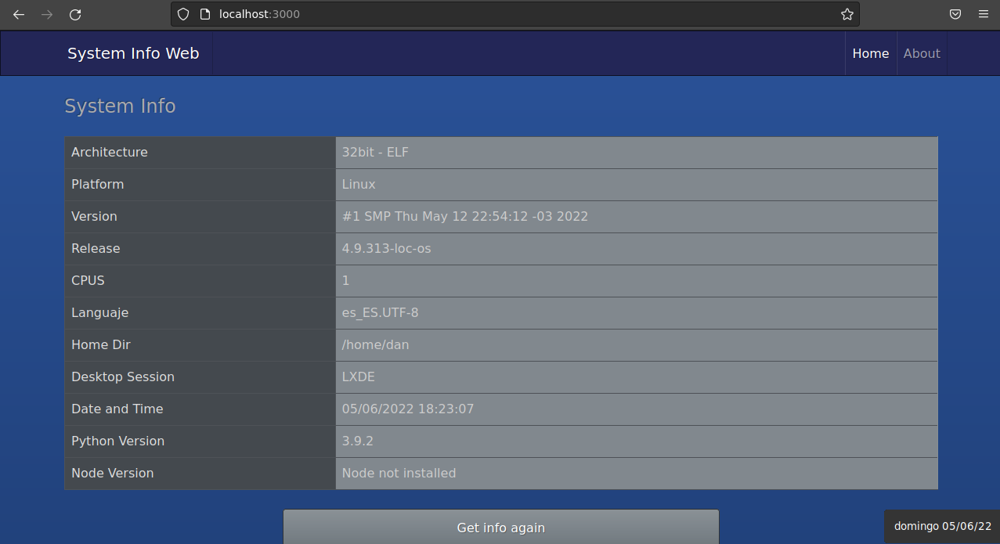

# System Info Web.

Web application made with python3 for get util system info.

## Installation.
```bash
$ git clone https://github.com/EduardYan/system-info-web.git
$ cd system-info-web
```

## Dependencies.
Require **python3.9.2** and flask module for create the server.

```bash
$ pip3 install -r ./requirements.txt
```

## Running.
```bash
$ python3 ./index.py
```

**Or also**

```bash
$ ./index.py
```

Now the app is running in this direction: <a href="http://localhost:3000" rel="noreffer">http://localhost:3000</a>

# Screenshot.

